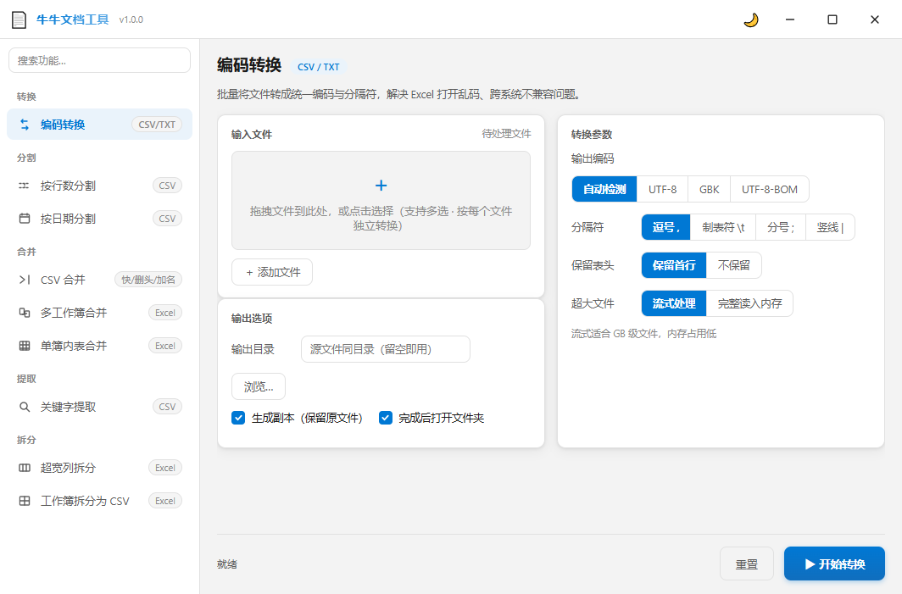

# 🐄 牛牛文档工具

> 解决「CSV 在 WPS 正常、在 Excel 打开乱码」的本地文档工具，支持超大 CSV 分割、合并、关键字提取和 Excel 工作簿操作。无需安装，双击即用。


---

## ✨ 功能一览（9 大工具）

| # | 功能 | 说明 |
|---|------|------|
| 1 | **编码转换** | 自动检测 CSV 编码（BOM / UTF-8 / GBK 系列），输出带 BOM 的 UTF-8，Excel 打开不乱码 |
| 2 | **按行数分割** | 把大 CSV 按指定行数拆成多个小文件，每片含表头 |
| 3 | **按日期分割** | 指定日期列，按天/月/年拆分为独立文件 |
| 4 | **CSV 合并** | 合并多个 CSV，支持三种模式：快速块级拼接 / 删除多余表头 / 每行追加「来源文件」列 |
| 5 | **合并多个工作簿** | 将多个 Excel 工作簿合并为一个（按表名或文件名归并所有工作表） |
| 6 | **合并工作表** | 将单个工作簿内的多个工作表纵向合并为一个（可选追加来源列） |
| 7 | **关键字提取** | 筛选包含指定关键字的行，支持多关键字和正则 |
| 8 | **工作簿拆分为 CSV** | Excel 工作簿 → 多个 CSV（每表一个，UTF-8-BOM） |
| 9 | **超宽列拆分** | 超 256 列的工作表拆分为多个 ≤256 列的工作表 |

**通用特性**：深浅色主题切换 · 文件拖拽添加 · 可配置输出目录 · 完成后自动打开文件夹 · DPI 自适应

## 🖥️ 界面预览



---

## 📥 直接使用（无需安装 Python）

1. 从 [Releases](https://github.com/heylumen/niuniu-docs-tool/releases) 页面下载
2. 双击运行即可

> 仅支持 Windows 10/11（依赖 EdgeWebView2 运行时，Win10/11 通常已内置）。

---

## 🛠️ 从源码运行

### 环境要求

- **Python 3.13+**（必须自带 `tkinter`，标准 CPython for Windows 安装包已内置）
- Windows 10/11

### 安装依赖并运行

```bash
pip install -r requirements.txt
python src/app_webview.py
```

### 打包为 EXE

```bash
python build.py
```

产物在 `dist` 目录，自动复制到项目根目录。

> 打包前验证 tkinter 可用：`python -c "import tkinter; print(tkinter.TkVersion)"` 应输出 `8.6`

---

## 📁 项目结构

```
牛牛文档工具/
├── VERSION                        # 版本号（唯一事实来源）
├── LICENSE                        # MIT 许可证
├── README.md
├── requirements.txt               # 运行时依赖
├── build.py                       # 一键打包脚本
├── src/
│   ├── app_webview.py             # 主程序（pywebview 窗口 + API）
│   ├── app.html                   # UI 界面（HTML/CSS/JS）
│   ├── app_icon.ico
│   └── core/                      # 业务逻辑层
│       ├── api_business.py        # 9 个 exec_* 业务功能
│       ├── encoding.py            # 编码检测引擎
│       ├── convert.py             # 编码转换
│       ├── split.py               # CSV 分割（按行/按日期）
│       ├── merge.py               # CSV/Excel 合并（CSV 快/删头/加名 · 多工作簿 · 工作表）
│       ├── extract.py             # 关键字提取
│       ├── sheet.py               # Excel 工作簿操作
│       └── utils.py               # 通用工具函数
├── tests/                         # 单元测试（85 项）
├── scripts/
│   └── review_check.py             # 提交前审查门禁
├── tools/
│   ├── cow_icon_v4.py             # 图标生成脚本
│   └── version.py                 # 版本管理工具
├── assets/icons/                  # 图标资源
└── docs/
    └── CHANGELOG.md               # 版本变更记录
```

---

## 🧪 测试

```bash
# 运行全部 85 项单元测试
python -m unittest discover -s tests -p "test_*.py" -v

# 提交前门禁检查（11 项静态分析）
python scripts/review_check.py
```

---

## 🏗️ 架构

```
┌─────────────────────────────────────────┐
│           app.html (WebView UI)          │  ← 渲染层：HTML/CSS/JS
│  drag-and-drop · themes · file list     │
└──────────────┬──────────────────────────┘
               │  window.pywebview.api.*()
┌──────────────┴──────────────────────────┐
│        app_webview.py (Api class)        │  ← 桥接层：Python
│  file management · window control       │
│  progress callbacks · Win32 resize      │
└──────────────┬──────────────────────────┘
               │  calls into
┌──────────────┴──────────────────────────┐
│           core/ (pure Python)            │  ← 业务层：无 UI 依赖
│  encoding · convert · split · merge      │
│  extract · sheet · utils                │
└─────────────────────────────────────────┘
```

- **渲染层** = 浏览器内核（EdgeWebView2），界面即 `src/app.html`
- **桥接层** = pywebview JS↔Python bridge，窗口控制 + 文件管理 + 进度回调
- **业务层** = 纯 Python，无 UI 依赖，可独立测试

---

## 📝 版本管理

```bash
python tools/version.py current          # 查看当前版本
python tools/version.py list             # 列出所有版本标签
python tools/version.py bump patch       # 递增版本号并提交打 tag
```

版本号遵循 [Semantic Versioning](https://semver.org/)，唯一事实来源为 `VERSION` 文件。

---

## 📄 许可证

[MIT License](LICENSE) © 2026 heylumen
